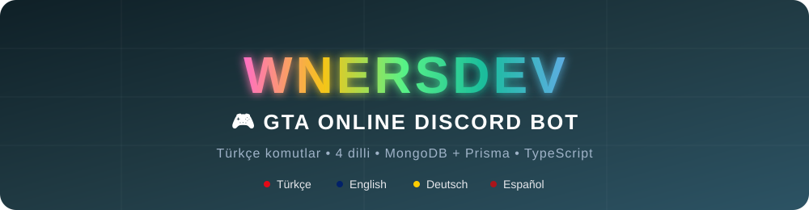
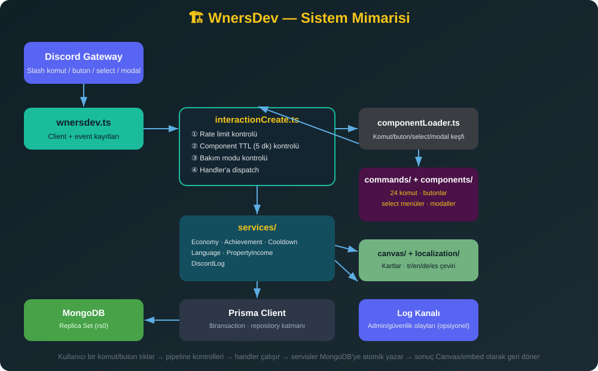
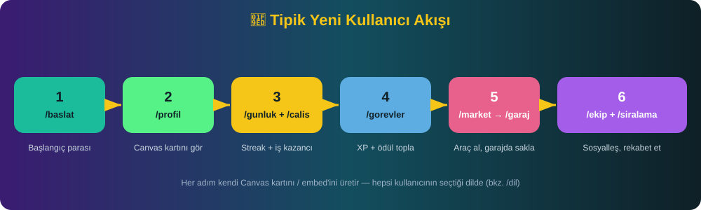
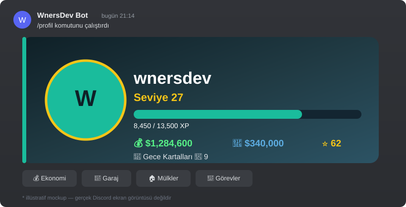
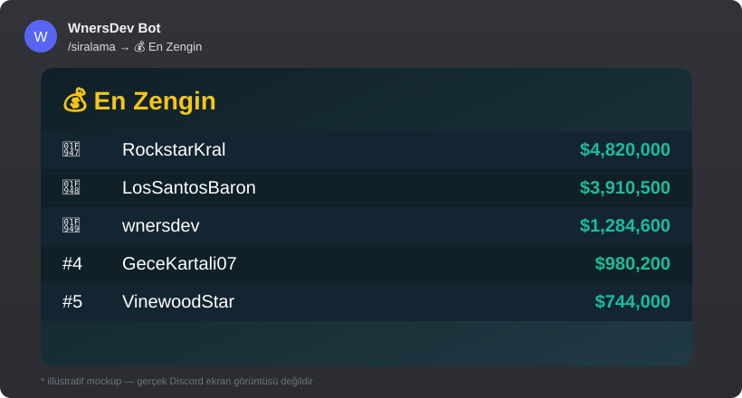

<div align="center">



<br/>

[](https://www.typescriptlang.org/)
[](https://discord.js.org/)
[](https://www.mongodb.com/)
[](https://www.prisma.io/)
[](https://nodejs.org/)
[](LICENSE)

[]()
[]()
[]()
[]()

**GTA V Online'dan ilham alan, Türkçe komutlu, 4 dilli, tam donanımlı bir Discord ekonomi/oyun platformu.**

*Türkçe ana komutlar • Tam i18n (TR/EN/DE/ES) • MongoDB + Prisma • Canvas kartları • Achievement sistemi*

</div>

---

## 📑 İçindekiler

- [Öne Çıkan Özellikler](#-öne-çıkan-özellikler)
- [Mimari](#-mimari)
- [Kullanıcı Akışı](#-kullanıcı-akışı)
- [Önizleme](#-önizleme)
- [Komut Listesi](#-komut-listesi)
- [Teknoloji Yığını](#-teknoloji-yığını)
- [Proje Yapısı](#-proje-yapısı)
- [Kurulum](#-kurulum)
- [Windows'ta Tek Tık Kurulum](#-windowsta-tek-tık-kurulum)
- [Discord Bot İzinleri](#-discord-bot-i̇zinleri)
- [Prodüksiyon Dağıtımı](#-prodüksiyon-dağıtımı)
- [Test](#-test)
- [Yeni Dil Ekleme](#-yeni-dil-ekleme)
- [Sorun Giderme](#-sorun-giderme)
- [Lisans](#-lisans)

---

## ✨ Öne Çıkan Özellikler

<table>
<tr>
<td width="50%" valign="top">

### 🌍 Tam 4 Dilli Altyapı
Her embed, buton, select menu, hata mesajı, hatta Canvas kartlarındaki yazılar bile **Türkçe / English / Deutsch / Español** olarak tam çevrili. Eksik çeviri otomatik olarak Türkçe'ye düşer, bot asla kırılmaz.

### 💰 Merkezi Ekonomi
Nakit/banka, günlük ödül (streak takipli), meslek sistemi, transfer — hepsi atomik Prisma transaction'ları ile çift harcamaya karşı korumalı, tam işlem defteri (ledger) ile.

### 🎯 Görev & Meslek Sistemi
7 farklı meslek, zorluk seviyeli görevler, cooldown yönetimi, XP/seviye sistemi.

### 🚗 Araç & 🏠 Mülk
Kategorili araç kataloğu, garaj yönetimi, favoriye alma, satış; pasif gelir üreten mülkler (4 saatte bir toplanabilir).

</td>
<td width="50%" valign="top">

### 🏅 Otomatik Achievement Sistemi
6 farklı başarı, durum değişikliklerinde otomatik açılır (ilk kazanç, milyoner, koleksiyoncu, mülk kralı, görev ustası, ekip lideri) — özel Canvas kartıyla bildirilir.

### 🎨 Canvas Kartları
Profil, günlük ödül, görev tamamlama, araç, mülk, sıralama ve başarı kartları — hepsi `node-canvas` ile dinamik render edilir, kullanıcının diline göre.

### 🔐 Güvenlik & Anti-Exploit
Negatif/sıfır/overflow miktar korumaları, transactional çift-satın-alma koruması, sahiplik kontrolleri, rate limiting, bakım modu, 5 dakikalık component TTL süresi.

### 👮 Tam Admin Araç Seti
7 admin komutu: kullanıcı inceleme, ekonomi düzenleme, araç/mülk/görev ekleme, bakım modu, sistem logu — opsiyonel olarak Discord log kanalına da yansıtılır.

</td>
</tr>
</table>

---

## 🏗️ Mimari

<div align="center">

</div>

**Nasıl çalışır — adım adım:**

1. **Discord Gateway**, bir slash komut / buton / select menu / modal etkileşimini `wnersdev.ts`'e (Discord Client) iletir.
2. **`interactionCreate.ts`** her etkileşimi 4 aşamalı bir pipeline'dan geçirir: ① rate-limit kontrolü (kullanıcı başına kayan pencere), ② component yaşı kontrolü (5 dakikadan eski buton/select otomatik "süresi doldu" olur), ③ bakım modu kontrolü, ④ doğru handler'a yönlendirme.
3. **`componentLoader.ts`**, `commands/`, `components/buttons/`, `components/selectMenus/`, `components/modals/` klasörlerini uygulama açılışında tek seferlik tarar — yeni bir dosya eklemek otomatik olarak kaydolur, hiçbir merkezi kayıt listesi güncellemesi gerekmez.
4. Handler, ilgili **servisi** çağırır (`EconomyService` para hareketleri için, `AchievementService` başarı kontrolü için, `CooldownService` bekleme süreleri için, vb.) — servisler Prisma `$transaction` ile MongoDB'ye **atomik** olarak yazar.
5. Sonuç, kullanıcının diline göre **`localization/`** üzerinden çevrilir ve gerekiyorsa **`canvas/`** ile görsel bir karta dönüştürülür, embed olarak Discord'a geri gönderilir.
6. Admin/güvenlik olayları (`ADMIN_ACTION`, `RATE_LIMIT`, `EXPLOIT_ATTEMPT`) hem konsola (Pino) hem de yapılandırılmışsa **Discord log kanalına** yazılır.

**Kullanım ipucu:** Bu diyagramı güncel tutmak istersen, `docs/assets/architecture.svg` düz bir metin dosyası — herhangi bir editörle (ya da [SVG-Edit](https://svgedit.netlify.app/) gibi çevrimiçi bir araçla) açıp kutuları/okları düzenleyebilirsin, harici bir tasarım programına ihtiyacın yok.

---

## 🧭 Kullanıcı Akışı

<div align="center">

</div>

Yeni bir oyuncunun botla tipik ilk teması genelde şu sırayla gider — her adım da yukarıdaki mimarinin aynı pipeline'ından geçer:

| # | Komut | Ne olur |
|---|---|---|
| 1 | `/baslat` | Profil oluşturulur, başlangıç nakdi verilir, onboarding butonları gösterilir |
| 2 | `/profil` | Canvas ile render edilmiş oyuncu kartı (seviye, XP çubuğu, bakiye) görüntülenir |
| 3 | `/gunluk` + `/calis` | Streak'li günlük ödül ve meslek bazlı iş kazancı toplanır |
| 4 | `/gorevler` | Bir görev seçilir, tamamlanır, ödül + XP kazanılır, Canvas kartı gönderilir |
| 5 | `/market` → `/garaj` | Bir araç satın alınır, garajda görüntülenir/yönetilir |
| 6 | `/ekip` + `/siralama` | Bir ekibe katılır/kurar, 7 kategorili sıralamada yerini görür |

---

## 🖼️ Önizleme

> ⚠️ **Not:** Aşağıdaki görseller, bot arayüzünün nasıl görüneceğini göstermek için hazırlanmış **illüstratif mockup'lardır** — gerçek Discord ekran görüntüsü değildir (bot henüz canlı bir sunucuda çalıştırılmadı). Gerçek ekran görüntülerini/GIF'lerini kendi sunucunda çalıştırdıktan sonra buraya ekleyebilirsin.

<table>
<tr>
<td align="center" width="50%">

<sub><code>/profil</code> — Canvas ile render edilen oyuncu kartı</sub>
</td>
<td align="center" width="50%">

<sub><code>/siralama</code> — 7 kategorili canlı sıralama tablosu</sub>
</td>
</tr>
</table>

<details>
<summary><b>📸 Kendi ekran görüntülerini/GIF'lerini eklemek ister misin?</b></summary>

<br/>

1. Botu çalıştır, birkaç komutu test et, ekran görüntüsü al (ya da [ScreenToGif](https://www.screentogif.com/) / [LICEcap](https://www.cockos.com/licecap/) gibi bir araçla GIF kaydet).
2. Dosyaları `docs/assets/` altına koy (örn. `docs/assets/demo-profil.png`, `docs/assets/demo-ekonomi.gif`).
3. Bu README'deki mockup `` etiketlerini kendi dosyalarınla değiştir.
4. Daha zengin bir görünüm için [Recordit](https://recordit.co/) veya [Kap](https://getkap.co/) ile tüm bir komut akışını (örn. `/baslat` → `/profil` → `/gorevler`) tek bir GIF'te kaydedebilirsin.

</details>

---

## ⌨️ Komut Listesi

<details open>
<summary><b>👤 Oyuncu</b></summary>

| Komut | Açıklama |
|---|---|
| `/baslat` | Kariyerine başla, başlangıç parası al |
| `/profil` | Canvas ile render edilen profil kartını görüntüle |
| `/istatistik` | Detaylı istatistiklerini gör |
| `/ayarlar` | Bildirim tercihlerini yönet |
| `/dil` | Botun dilini değiştir (TR/EN/DE/ES) |
| `/yardim` | Tüm komutları listele |

</details>

<details open>
<summary><b>💰 Ekonomi</b></summary>

| Komut | Açıklama |
|---|---|
| `/bakiye goster` | Nakit/banka bakiyeni gör |
| `/bakiye yatir` \| `cek` | Bankaya para yatır / çek |
| `/bakiye transfer` | Başka bir oyuncuya para gönder (buton ile modal da açılır) |
| `/gunluk` | Günlük ödülünü al (streak takipli) |
| `/calis` | Bir meslekte çalışıp para + XP kazan |

</details>

<details open>
<summary><b>🎯 Görev, 🚗 Araç, 🏠 Mülk</b></summary>

| Komut | Açıklama |
|---|---|
| `/gorevler` | Mevcut görevleri listele, tamamla |
| `/araclar` | Kategoriye göre araç kataloğuna göz at, satın al |
| `/garaj` | Sahip olduğun araçları yönet (favori, sat) |
| `/mulk listele` \| `mulklerim` | Mülk kataloğuna bak / sahip olduklarını gör |
| `/mulk gelir-topla` | Mülklerinden birikmiş pasif geliri topla |

</details>

<details open>
<summary><b>🛒 Market, 👥 Ekip, 🏆 Sıralama</b></summary>

| Komut | Açıklama |
|---|---|
| `/market` | Araç/mülk/eşya kategorilerine göz at, satın al |
| `/envanter` | Eşyalarını görüntüle, sat |
| `/ekip olustur` \| `hizli-olustur` | Ekip kur (slash seçeneği veya form/modal ile) |
| `/ekip davet` \| `at` \| `yukselt` \| `ayril` \| `bilgi` \| `uyeler` | Ekip yönetimi |
| `/siralama` | 7 kategoride canlı sıralama (zengin, seviye, itibar, araç, mülk, görev, ekip) |

</details>

<details>
<summary><b>👮 Admin (yetki gerektirir)</b></summary>

| Komut | Açıklama |
|---|---|
| `/admin-kullanici` | Bir kullanıcının tüm istatistiklerini incele |
| `/admin-ekonomi` | Bir kullanıcının bakiyesini düzenle |
| `/admin-arac` \| `admin-mulk` \| `admin-gorev` | Kataloğa yeni içerik ekle |
| `/admin-sistem` | Bakım modunu aç/kapat (onay adımlı) |
| `/admin-log` | Son işlemleri sistem logu olarak gör |

</details>

---

## 🛠️ Teknoloji Yığını

| Katman | Teknoloji |
|---|---|
| Dil | TypeScript (strict mode) |
| Discord | discord.js v14 |
| Veritabanı | **MongoDB** (replica set) |
| ORM | Prisma (MongoDB connector) |
| Doğrulama | Zod |
| Görsel | node-canvas |
| Log | Pino + pino-pretty |
| Test | Vitest |
| Terminal | chalk (renkli başlangıç banner'ı) |

## 📂 Proje Yapısı

```
wnersdev.ts              # Kök giriş noktası — npm run dev / npx tsx wnersdev.ts bunu çalıştırır.
                          # Gerçek mantık src/wnersdev.ts'de, buradan içe aktarılır.
run.bat                  # Windows: TÜM kurulumu yapar (install, config kontrolü, prisma
                          # generate/push/seed, komut kaydı) ve botu başlatır. İdempotent.
deploy-komutlar.bat      # Windows: sadece slash komutlarını yeniden kaydeder.

src/
├── wnersdev.ts          # Asıl giriş mantığı (Discord client'ı kurar, her şeyi bağlar)
├── deploy-commands.ts   # Slash komut kayıt script'i
├── commands/            # Her slash komut için tek düz dosya (admin/ hariç — orada
│   └── admin/           # birden fazla ilişkili admin komutu birlikte gruplanıyor)
├── components/
│   ├── buttons/          # Buton handler'ları
│   ├── selectMenus/       # Select menu handler'ları
│   ├── modals/            # Modal handler'ları
│   ├── pagination/        # Yeniden kullanılabilir sayfalama satırı
│   └── shared/             # Çapraz-kesen görünüm oluşturucular (mülk/eşya listeleri, achievement bildirimleri)
├── services/              # EconomyService, CooldownService, LanguageService, AchievementService, DiscordLogService...
├── repositories/          # UserRepository (Prisma veri erişimi)
├── database/              # Prisma client singleton
├── events/                # ready, interactionCreate
├── middleware/            # yetki + sahiplik + rate-limit koruması
├── canvas/                # Canvas kart render'ları
├── localization/          # i18n loader + locales/{tr,en,de,es}/*.json
├── loaders/                # Dinamik komut/component yükleyici
├── utils/                  # logger, embeds, validation (Zod şemaları), banner
├── config/                 # ayarlar.ts (config/ayarlar.json'u okur), oyun sabitleri
└── types/                   # Paylaşılan TS tipleri

config/
├── ayarlar.example.json    # ayar şablonu (git'te takip edilir)
└── ayarlar.json            # gerçek ayarların — git-ignored, .env dosyası yok

docs/assets/                # README görselleri (banner + mockup'lar)
scripts/run-with-config.js  # Prisma CLI alt process'ine ayarlar.json'dan DATABASE_URL enjekte eder
```

---

## 🚀 Kurulum

### Gereksinimler

- Node.js **20+**
- **MongoDB 6+, replica set olarak çalışıyor** (tek node bile olsa — aşağıda neden gerektiğini açıklıyoruz, `docker-compose.yml` bunu otomatik hallediyor)
- Bir Discord uygulaması + bot token'ı ([Discord Developer Portal](https://discord.com/developers/applications))

<details>
<summary><b>❓ MongoDB neden replica set olmak zorunda?</b></summary>

<br/>

`EconomyService` ve her satın alma akışı (araç, mülk, market eşyası) okuma/yazmalarını `prisma.$transaction(...)` içine alıyor — çift harcama ve eşzamanlı satın alma yarış durumlarını önlemek için. **MongoDB çoklu-doküman transaction'ları SADECE replica set üzerinde destekler** — tekil bir `mongod` bunu reddeder. Bu, tek-node'luk yerel bir kurulum için bile geçerli; sadece tek üyeli bir replica set başlatman yeterli. `docker-compose.yml` bunu otomatik yapar. Docker kullanmayan yerel bir MongoDB için bir kere şunu çalıştır:

```bash
mongosh --eval "rs.initiate()"
```

</details>

### Adım Adım

**1) Bağımlılıkları kur**
```bash
npm install
```

**2) Ayarları yapılandır** — bu projede `.env` **yok**, her şey `config/ayarlar.json`'da:
```bash
cp config/ayarlar.example.json config/ayarlar.json
```
Doldurman gerekenler:

| Alan | Açıklama |
|---|---|
| `discordToken` | Bot token'ın |
| `clientId` | Uygulamanın client ID'si |
| `devGuildId` | Anında test için bir sunucu ID'si |
| `databaseUrl` | `mongodb://localhost:27017/gta_bot?replicaSet=rs0&minPoolSize=10&maxPoolSize=100` |
| `logChannelId`, `adminRoleId` | Opsiyonel, boş bırakılabilir, sonra `/admin-sistem` ile ayarlanır |
| `defaultLanguage` | `tr` \| `en` \| `de` \| `es` |
| `nodeEnv` | `development` \| `production` |

`config/ayarlar.json` git-ignored (token'ını içerdiği için) — direkt düzenlemen güvenli.

**3) Veritabanını hazırla**
```bash
npm run prisma:push    # şemadan koleksiyon/index'leri senkronize eder (Mongo'da SQL migration yok)
npm run prisma:seed    # araçlar, mülkler, görevler, başarılar, eşyaları doldurur
```

**4) Slash komutlarını kaydet**
```bash
npm run deploy:commands
```

**5) Botu çalıştır**
```bash
npm run dev
```

---

## 🖱️ Windows'ta Tek Tık Kurulum

Yukarıdaki 3–5. adımları atlayıp direkt **`run.bat`**'a çift tıklayabilirsin:

```
✔  node_modules yoksa → npm install
✔  config/ayarlar.json yoksa → örnekten oluşturur, doldurman için durur
✔  npm run prisma:generate
✔  npm run prisma:push
✔  npm run prisma:seed
✔  Slash komutlarını Discord'a kaydeder (sadece ilk seferde)
✔  Botu başlatır
```

Her çalıştırmada güvenli — her adım zaten yapılmışsa atlanır. Yeni bir komut eklediğinde/değiştirdiğinde **`deploy-komutlar.bat`**'ı çalıştır.

---

## 🔑 Discord Bot İzinleri

Botu davet ederken en az şunları ver:
- `applications.commands` scope
- `bot` scope: Send Messages, Embed Links, Attach Files, Use Slash Commands, Read Message History

Developer Portal → Bot sekmesinden **Server Members Intent**'i aç (ekip üyesi sorguları için gerekli).

---

## 🐳 Prodüksiyon Dağıtımı

### Seçenek A — Docker Compose (önerilen)

```bash
cp config/ayarlar.example.json config/ayarlar.json
# databaseUrl'i şuna ayarla: mongodb://mongo:27017/gta_bot?replicaSet=rs0&minPoolSize=10&maxPoolSize=100
docker compose up -d --build
```

MongoDB'yi (tek-node replica set olarak — healthcheck ilk açılışta otomatik `rs.initiate()` çalıştırır) ve botu birlikte başlatır. `config/ayarlar.json` container'a salt-okunur olarak bağlanır (asla image'a gömülmez — `.dockerignore`'a bak).

```bash
docker compose exec bot npm run prisma:seed
npm run deploy:commands:global   # ya da tek sunucu için deploy:commands
```

### Seçenek B — Bare metal / VM

```bash
npm install --omit=dev
npm run build
npm run prisma:push
node dist/wnersdev.js
```

---

## 🧪 Test

```bash
npm test          # tek seferlik
npm run test:watch
```

**9 test dosyası** kapsıyor: ekonomi (negatif/sıfır/overflow miktar, yetersiz bakiye, kendine transfer, tam bakiye hareketi), cooldown/streak mantığı, i18n fallback zinciri, achievement açılma koşulları, mülk geliri toplama, dil çözümleme zinciri, rate limiter, Zod doğrulama şemaları, sayfalama.

---

## 🌐 Yeni Dil Ekleme

1. `src/config/game.ts` içindeki `SUPPORTED_LANGUAGES`'a dil kodunu ekle.
2. `src/localization/locales/<kod>/` altında mevcut dillerle aynı 13 JSON dosyasını oluştur (`common`, `economy`, `profile`, `vehicles`, `missions`, `properties`, `crew`, `market`, `inventory`, `leaderboard`, `achievements`, `admin`, `errors`) — her anahtar eşleşmeli.
3. `common.json`'ın `language` bloğuna yeni dilin bayrak/isim girdisini her locale için ekle.

Eksik anahtarlar otomatik olarak Türkçe'ye düşer (`FALLBACK_LANGUAGE`), yani yarım kalan bir çeviri botu asla kırmaz.

---

## 🩺 Sorun Giderme

| Belirti | Olası Sebep | Çözüm |
|---|---|---|
| Slash komutları görünmüyor | Henüz kaydedilmedi, ya da global kaydedildi ve hâlâ yayılıyor | `devGuildId`'ye karşı `npm run deploy:commands` çalıştır |
| `Transaction API is not yet supported` | MongoDB replica set olarak çalışmıyor | `mongosh --eval "rs.initiate()"` çalıştır (Docker Compose bunu otomatik yapar) |
| `PrismaClientInitializationError` | `databaseUrl` yanlış veya MongoDB'ye ulaşılamıyor | MongoDB'nin çalıştığını ve bağlantı dizesini doğrula |
| `❌ Ayarlar dosyası bulunamadı` | `config/ayarlar.json` henüz yok | `cp config/ayarlar.example.json config/ayarlar.json` |
| `prisma db push` / `generate` / `studio` veritabanını bulamıyor | Bunlar ayrı bir CLI process'i, gerçek bir env var gerekiyor | Her zaman `npm run prisma:push` gibi npm script'leri üzerinden çalıştır |
| Canvas kartları render olmuyor / build `canvas` paketinde patlıyor | Native build bağımlılıkları eksik | `libcairo2-dev libpango1.0-dev libjpeg-dev libgif-dev librsvg2-dev build-essential` kur (Dockerfile'da zaten var) |
| Admin komutlarında "yetkin yok" | `adminRoleId` ayarlanmamış, kullanıcı da Administrator değil | `GuildSettings`'te admin rol ID'sini ayarla |
| Ekip komutları üye bulamıyor | **Server Members Intent** kapalı | Developer Portal → Bot sekmesinden aç, botu yeniden başlat |
| Bot herkese "bakımda" diyor | Bakım modu açık kalmış | `/admin-sistem bakim:false` |

---

## 📄 Lisans

[MIT](LICENSE) — özgürce kullan, değiştir, dağıt.

<div align="center">

---

Yapımcı: **WnersDev** 🎮

</div>
